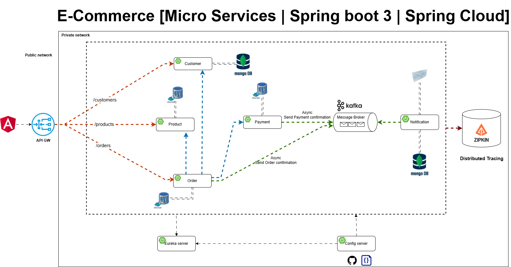

# 🛒 E-Commerce Microservices Application

A full-stack, cloud-native **E-Commerce Application** built using **Spring Boot 3**, **Spring Cloud**, **Apache Kafka**, **MongoDB**, **PostgreSQL**.
This system follows a **microservices architecture**, with distributed tracing, service discovery, centralized configuration, and asynchronous communication using Kafka.

---

## 📦 Tech Stack

### 🔧 Backend (Microservices)
- **Spring Boot 3**
- **Spring Cloud** (Eureka, Config Server, Gateway)
- **Apache Kafka** (Async messaging)
- **MongoDB** & **PostgreSQL**
- **Spring Data JPA** / **Spring Data MongoDB**
- **Zipkin** (Distributed Tracing)
- **Docker**

### 🔗 Infrastructure
- **Eureka Server** – Service discovery
- **Spring Cloud Config Server** – Centralized configuration
- **API Gateway** – Routing and request forwarding
- **Kafka** – Message broker for async events

---

## 📁 Microservices Overview

### 1. **Customer Service**
- Manages customer profiles.
- Persists data in **MongoDB**.
- API endpoint: `/customers`

### 2. **Product Service**
- Manages product catalog.
- Persists data in **PostgreSQL**.
- API endpoint: `/products`

### 3. **Order Service**
- Manages order placement.
- Interacts with Customer and Product services.
- Sends **Order Confirmation** events to Kafka.
- Persists data in **PostgreSQL**.
- API endpoint: `/orders`

### 4. **Payment Service**
- Handles payment processing.
- Sends **Payment Confirmation** to Kafka.
- Persists data in **PostgreSQL**.

### 5. **Notification Service**
- Listens to Kafka for Order and Payment confirmation.
- Sends notification emails to users.
- Stores logs in **MongoDB**.

---

## 🔁 Async Communication

- **Order Service ➝ Kafka ➝ Notification Service**
- **Payment Service ➝ Kafka ➝ Notification Service**

---

## 🔍 Distributed Tracing

- All services are instrumented with **Zipkin** to trace request flow across microservices.

---

## 📡 API Gateway

- Built with **Spring Cloud Gateway**.
- Routes:
  - `/customers/** ➝ Customer Service`
  - `/products/** ➝ Product Service`
  - `/orders/** ➝ Order Service`

---

## ⚙️ Service Discovery

- All services register with **Eureka Server**.
- **API Gateway** uses Eureka to route requests dynamically.

---

## 📃 Centralized Configuration

- Each microservice pulls configuration from **Spring Cloud Config Server**.
- Configs are stored in a Git-backed repo.

---

## 🚀 Getting Started

### Prerequisites
- Docker & Docker Compose
- Java 21
- Maven
- Git

---

### ⚙️ Running the application
- Make sure Docker containers are running and API Gateway has successfully registered all services.
- Run all the services in the given order:
- Config-server, discovery, 5 microservices in any order and then gateway

---

## 🔎 Service Access & Monitoring

Once the application and supporting services are up using Docker Compose (`docker-compose up`), you can access the following tools to monitor and debug the microservices:

### 🔁 Service Discovery - Eureka Server

- **Description:** Eureka is the service registry where all microservices register themselves and discover each other.
- **Default URL:** [http://localhost:8761](http://localhost:8761)
- **What to check:** Each microservice should appear as a registered instance here. Refresh the page to see dynamic status updates.

---

### 📦 Distributed Tracing - Zipkin

- **Description:** Zipkin provides distributed tracing to follow the path of a request as it travels through the services.
- **Default URL:** [http://localhost:9411](http://localhost:9411)
- **How to use:**
  - Make a request through your frontend (e.g. placing an order).
  - Visit the Zipkin UI and click “Find Traces”.
  - You'll see the full timeline and breakdown of microservice interactions.

---

### 📬 Mail Testing - MailDev

- **Description:** MailDev captures outgoing emails sent by the Notification Service (e.g., order or payment confirmations).
- **MailDev UI:** [http://localhost:1080](http://localhost:1080)
- **SMTP Host & Port:**
  - Host: `localhost`
  - Port: `1025`
- **Use case:** When Notification service sends an email, it will be displayed here for preview.

---

### 🐘 PostgreSQL & pgAdmin

- **PostgreSQL Database:**
  - Host: `localhost`
  - Port: `5432`
  - Username: `postgres`
  - Password: `postgres`

- **pgAdmin UI:**
  - URL: [http://localhost:5050](http://localhost:5050)
  - Email: `pgadmin4@pgadmin.org` (default)
  - Password: `admin` (default)

> After logging in to pgAdmin, you’ll need to register the PostgreSQL server manually with:
> - Host: `postgresql`
> - Port: `5432`

---

### 🍃 MongoDB & Mongo Express

- **MongoDB Instance:**
  - Host: `localhost`
  - Port: `27017`
  - Username: `root`
  - Password: `root`

- **Mongo Express UI:**
  - URL: [http://localhost:8081](http://localhost:8081)
  - Login using the above credentials

---

### 🔗 Kafka & Zookeeper (Internal)

- **Kafka Broker:** `localhost:9092`
- **Zookeeper:** `localhost:22181`

> Use external tools like [AKHQ](https://akhq.io/) or [Kafka Tool](https://kafkatool.com/) if you want a Kafka UI.

---

### ✅ Quick Reference Table

| Service        | URL                             | Notes                                 |
|----------------|----------------------------------|---------------------------------------|
| Eureka Server  | http://localhost:8761           | Service registry                      |
| Zipkin         | http://localhost:9411           | Distributed tracing UI                |
| MailDev        | http://localhost:1080           | Test email inbox                      |
| pgAdmin        | http://localhost:5050           | PostgreSQL admin GUI                  |
| Mongo Express  | http://localhost:8081           | MongoDB web UI                        |

---

## 🧪 API Testing with Postman

You can interact with the system using the following API endpoints exposed via the **API Gateway** (`localhost:8222`).

| Method | Endpoint                                  | Description         |
|--------|-------------------------------------------|---------------------|
| GET    | `http://localhost:8222/api/v1/products`   | Retrieve all products |
| POST   | `http://localhost:8222/api/v1/customers`  | Create a new customer |
| POST   | `http://localhost:8222/api/v1/orders`     | Create a new order |

### ⚙️ Setup for Postman
- Base URL: `http://localhost:8222/api/v1`
- Make sure Docker containers are running and API Gateway has successfully registered all services.

---
